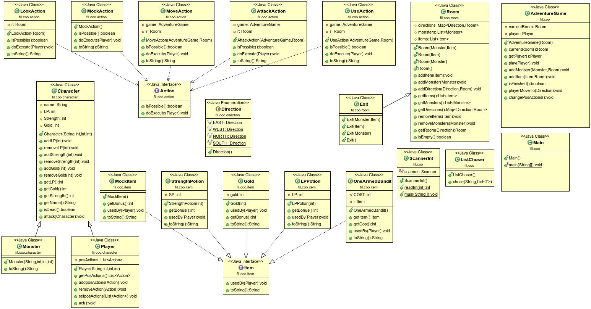

# Projet DONJON
## Auteurs:
**Filali Youva**
## Introduction du sujet:
**DonJon** (en anglais **Dungeon**) signifie en réalité *cachot*. En résumé, le **DonJon** est une forme de lieu clos composé de plusieurs chambres ou le jouer doit chercher l'exit. Le joueur commence dans une chambre ou il y a un ou plusieurs monstres, objets et issus, le joueur peut changer de chambre qu'après avoir tué tous les monstres et utiliser tous les objets. Le jeu finit lorsque le jouer atteigne une chambre spécial appellé **Exit Room** ou lorsqu'il meurt.

## How To:
Pour utiliser le projet:

`

#### Se positionner dans la racine du projet:

Comme on a clonné l'ensemble des TPs et non seulement le projet. Faut se positionner dans la racine du projet **DonJon** avec la commande:

`cd COO-DONJON`

#### Générer la JavaDoc:

`mvn javadoc:javadoc`

La Javadoc généré se retrouvera donc dans *target/docs*.

#### Générer le Projet:

`mvn package`

#### Execution de l'archive généré:

`java -jar target/COO-DONJON-1.0-SNAPSHOT.jar`

## Diagramme UML:

## Présentation d'élement du code (ce qui est intéressant):

* Utilisation des méthodes génériques (ListChoser.Chose)
* Utilisation des Mocks pour les tests (MockItem et MockAction)
* Ajout d'un timer qui fait en sorte que les lignes soient imprimés avec un lapse de temps entre chacunes d'elles.

## Design patterns:
* Utilisé surtout dans les tests avec l'ajout de quelques fonctions abstraite dans les test des Actions et Items.

